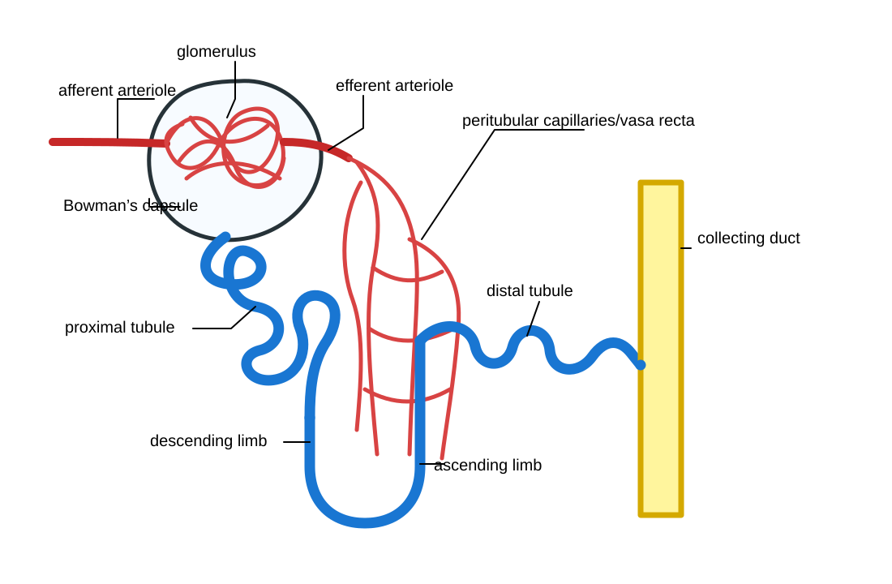

# Challenge: draw a nephron with HopGPT

For advanced HopGPT users. One prompt, and the model writes a teaching figure as code.

SVG is a figure written as plain text. The shapes, colors and labels are lines of code, so a language model can write one directly. The result is vector art: it stays sharp at any size, and you can open and edit it in Illustrator, Inkscape or PowerPoint.

## How to try it

1. Open [HopGPT](https://chat.ai.jh.edu/) and pick a model. (Any chat model works for this, but this one is a good reason to try HopGPT.)
2. Copy the prompt below and paste it in.
3. Copy the model's entire reply, from `<svg` to `</svg>`, into a plain-text editor. On a Mac, open TextEdit and choose Format > Make Plain Text first. On Windows, use Notepad.
4. Save it as `nephron.svg`, then open the saved file in a web browser.

## The prompt

<button type="button" id="copy-prompt" style="margin:0 0 8px;padding:7px 14px;border:1px solid #002d72;background:#002d72;color:#fff;border-radius:6px;font:600 14px Arial,Helvetica,sans-serif;cursor:pointer">Copy prompt</button>

<pre id="nephron-prompt"><code>Create a clean, simplified, anatomically correct nephron schematic as editable SVG vector art. Prioritize correct connectivity over artistic detail. Show one nephron in this sequence: afferent arteriole → glomerular capillary tuft inside Bowman’s capsule → efferent arteriole → peritubular capillaries/vasa recta; and separately, Bowman’s capsule → proximal convoluted tubule → descending limb of the loop of Henle → hairpin turn → ascending limb → distal convoluted tubule → collecting duct. Connect the tubule continuously in that order with no gaps or crossings that imply incorrect anatomy. Place the glomerulus inside Bowman’s capsule; show the afferent arteriole entering and the efferent arteriole leaving the vascular pole. Show the collecting duct as a separate vertical tube receiving the distal tubule, not as part of the nephron loop. Use a simple textbook schematic, not a realistic anatomical rendering. Label only these structures: glomerulus, Bowman’s capsule, afferent arteriole, efferent arteriole, proximal tubule, descending limb, ascending limb, distal tubule, collecting duct, and peritubular capillaries/vasa recta. Use red for blood vessels, blue for the nephron tubule, yellow for the collecting duct, black labels, white background, and clear leader lines. Return only valid raw SVG code, with no Markdown or explanation. Afterward, instruct the user to copy the complete SVG code into a plain-text editor, save it as nephron.svg, and reopen the saved file in a web browser to view it. This is a schematic teaching figure, not a scale drawing.</code></pre>

## My result

This is what HopGPT gave me. It is not perfect, but it shows HopGPT at its current limit for this sort of thing.

[Download my SVG](nephron.svg){: download="nephron.svg"}

## Check it like a resident's drawing

The tubule runs in the right order, with no gaps, into a separate collecting duct. But it is not finished:

- The afferent and efferent arterioles enter and leave on opposite sides of the capsule. They should sit side by side at the vascular pole.
- Several labels collide with their own leader lines or with the drawing, for example "Bowman's capsule" and "ascending limb."

The next step is the real skill: ask follow-up questions until it is right, such as "Move the efferent arteriole so both arterioles sit at the vascular pole" or "Move every label so no line crosses any text." Then try the same approach on a figure you actually need.

[Back to the newsletter](/issues/)

