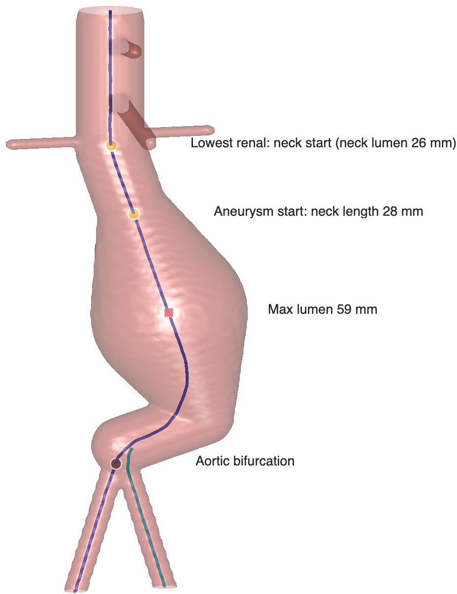

# Automated EVAR planner

An open-source MATLAB pipeline that turns a contrast-enhanced CT angiogram into the measurements used to plan endovascular aneurysm repair, and checks them against stent-graft instructions for use.

<figure style="margin: 0 0 24px;">
  
  <figcaption style="font-size: 15px; color: var(--muted); margin-top: 10px;">Output on a synthetic aneurysm phantom, not patient data. The bifurcated centerline is computed automatically and the neck is measured from the lowest renal artery. On this phantom the measured neck length was 28.4 mm against a true 29.6 mm.</figcaption>
</figure>

**[Source on GitHub](https://github.com/davidstonko/aortic-segmenter-and-surgery-planner)** &middot; MIT license &middot; MATLAB R2024a or later

Research use only. Not a medical device and not for clinical decisions.

## What it does

- Reads a CT angiogram from DICOM and segments the aorta, iliac arteries, kidneys and visceral branches with TotalSegmentator.
- Finds the renal, celiac and superior mesenteric arteries, extends the iliacs to the common femoral arteries, and repairs gaps using the contrast in the CT itself rather than drawing synthetic connections.
- Places the proximal and femoral endpoints automatically and builds a bifurcated centerline with VMTK.
- Measures the infrarenal neck from the lowest renal artery (diameter, length, angulation), the maximum aneurysm diameter, the iliac diameters and the iliac take-off angle.
- Compares those measurements with the labeled anatomic criteria of seven stent grafts. The device criteria were checked against manufacturer and FDA labeling in September 2026, and each entry cites its source document.
- Runs from a six-step graphical app or headlessly, and flags any result its own quality checks do not trust. It will not name a device for a flagged result.

## Where it stands

It works end to end on arterial-phase, aorta-protocol CT angiograms, but it does not yet generalize reliably. On my local test set of seven scans, two produced a usable plan, two ran but were flagged unusable by the built-in quality checks, and three stopped at automatic endpoint placement because the segmentation missed one iliac artery. No scan produced a bad plan silently.

The fix I am pursuing is a learned segmentation model trained on annotated scans from our own institution. The annotation protocol, de-identification tools and model integration are in place, and I am now collecting scans to annotate.

## What it does not do

- Diameters are measured on the contrast-filled lumen. They exclude mural thrombus, so they understate the outer-wall aneurysm diameter and can understate device criteria that are defined outer wall to outer wall.
- Common iliac seal length is not measured yet, because the segmentation does not separate the common from the external iliac artery. The plan reports it as not assessed.
- The measurements have not yet been validated against a clinical 3D workstation.

## Try it

The repository includes synthetic normal and aneurysmal phantoms, so you can run the pipeline without patient data. Installation, a quick start and the test suite are described in the [README](https://github.com/davidstonko/aortic-segmenter-and-surgery-planner#readme). Issues and pull requests are welcome.

